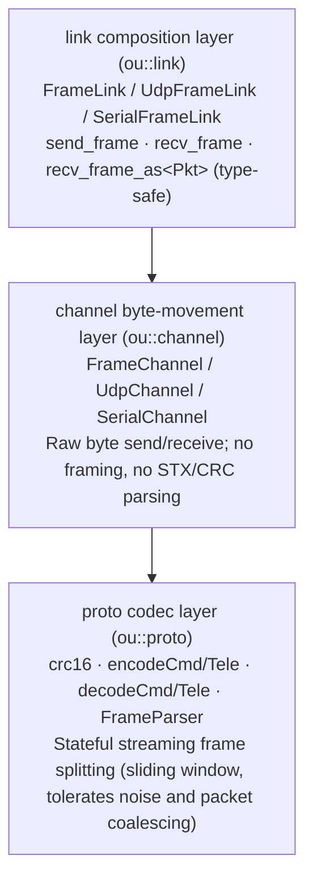
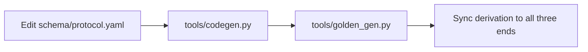
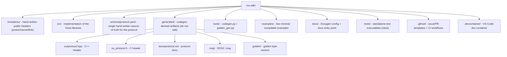

# ou_sdk: Underwater Robot Host-Station SDK

A C++20 SDK for the host station of an underwater robot. It provides the shared **protocol codec** and a **pluggable transport layer** for all three ends (host station / compute board / STM32 firmware).

[](https://github.com/OceanUgenLab/rov-sdk/actions/workflows/ci.yml)
[](LICENSE)
[](https://en.cppreference.com/w/cpp/20)
[](https://cmake.org/)

## Quick start

Requirements: CMake ≥ 3.16, a C++20 compiler, and Ninja (recommended). No external library dependencies; the standard library plus native POSIX APIs only.

```bash
# Clone
git clone https://github.com/OceanUgenLab/rov-sdk.git
cd rov-sdk

# Configure + build
cmake -S . -B build -G Ninja -DCMAKE_BUILD_TYPE=Release
cmake --build build

# Test (all 3 independent tests pass)
ctest --test-dir build --output-on-failure
```

### First snippet: the host station sends a control command

```cpp
#include <ou/protocol.hpp>    // CmdPacket, encodeCmd
#include <ou/udp_channel.hpp> // UdpChannel
#include <ou/frame_link.hpp>  // UdpFrameLink

int main() {
    ou::UdpChannel channel;
    channel.bind(0);                        // Local port assigned automatically
    channel.set_peer("192.168.2.2", 8081);  // Peer: slave address

    ou::UdpFrameLink link(channel);

    ou::CmdPacket cmd;
    cmd.armed = 1;      // Arm
    cmd.surge  = 0.5f;  // Half-speed forward

    auto frame = ou::encodeCmd(cmd);   // Encode into a complete frame (with CRC)
    link.send_frame(frame);            // Send
}
```

See [`examples/`](examples/) for more complete runnable examples:

- [`examples/host_command_sender/`](examples/host_command_sender/): the host station sends commands
- [`examples/board_telemetry_receiver/`](examples/board_telemetry_receiver/): the compute board receives telemetry

## Architecture layers



| Layer | Library | Alias | Responsibility |
|----|----|------|------|
| proto | `ou_proto` | `ou::proto` | CRC-16/MODBUS, frame encode/decode, stateful `FrameParser` streaming frame splitting |
| channel | `ou_channel` | `ou::channel` | Raw byte transport channels (UDP / serial); no framing, no parsing |
| link | `ou_link` | `ou::link` | Composition layer: holds a channel + FrameParser and provides `send_frame` / `recv_frame` / `recv_frame_as<Pkt>` type-safe receive |

`ou::link` propagates `ou::proto` + `ou::channel` through a PUBLIC link, so consumers only need to link `ou::link`.

## Protocol

The complete definition of the frame format `AA 55 | ver | len | type | payload | crc16` (v0.2.0, `ver=0x02`) and the golden frame vectors are in [`generated/docs/protocol.md`](generated/docs/protocol.md). The protocol is the common interface for the three ends (host-station SDK / compute board / STM32 firmware); this repository owns its implementation and documentation.

**The only path for protocol changes** (see [`CONTRIBUTING.md`](CONTRIBUTING.md)):



`schema/protocol.yaml` is the single hand-written source of truth. Every artifact under `generated/` (C++ header / C header / protocol docs / ROS2 `.msg` / golden vectors) is a derived result and must not be edited by hand.

## Integration

```cmake
add_subdirectory(rov-sdk)   # or find_package(ou_sdk)
target_link_libraries(app PRIVATE ou::link)
```

`examples/` shows the minimal integration path: reference the SDK root with `add_subdirectory` directly, without an install step.

## Project structure



## Documentation

- [`docs/index.md`](docs/index.md): docs entry point
- [`generated/docs/protocol.md`](generated/docs/protocol.md): authoritative protocol docs (auto-generated)
- [`CHANGELOG.md`](CHANGELOG.md) / [`CONTRIBUTING.md`](CONTRIBUTING.md)

Generate the API reference with `doxygen docs/Doxyfile`; output goes to `build/doxygen/html/`.

## License

[Apache License 2.0](LICENSE) © 2026 OceanUgenLab
